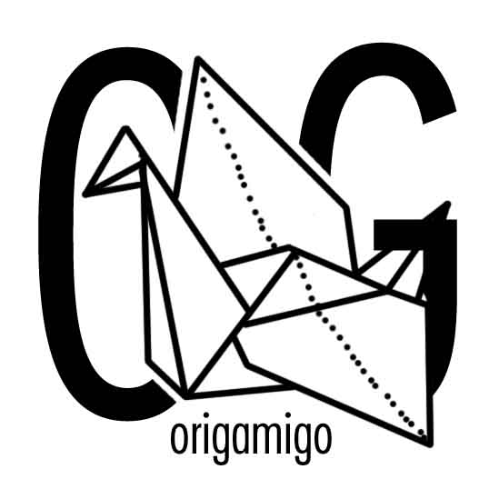

# OrigamiGo

This project was created for DubHacks 2019.

## Purpose
The application is for orgami lovers and people who are only beginning to learn origami. This step by step visual guide will allow you to easily follow and verify your steps. Using machine vision from Microsoft Azure and OpenCV, you'll never struggle to make origami again!

## Usage
To use clone this repo and make sure to have the Python libraries installed using `pip`

`git clone https://github.com/jackyruth/origamigo.git`

run from the repo

`python main.py`

### Dependencies
`pyttsx3`
`opencv-python`
`tensorflow==1.14`
`python 3.+ 64 bit`
`pillow`
`numpy`

## Development
Currently, this project can teach you how to fold an origami heart step by step, guided by voice. In the future, we hope to show visual cues on the application using augmented/mixed reality as well as add more origami projects. 

Each step was trained using Microsoft Azure Custom Vision API and mulitple photos. 